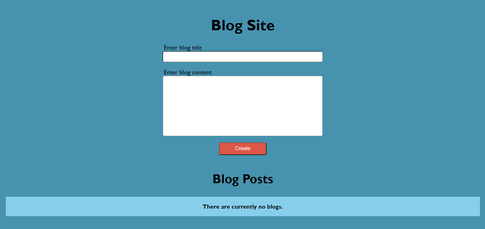

# Blog Site

Welcome to my Blog Site! This web application allows users to create, edit, and delete blog posts. It is built using Node.js and EJS for frontend templating, providing a simple interface for managing blog content.



## Features

- Create new blog posts
- Edit existing blog posts
- Delete blog posts

## Getting Started

Follow these steps to get the application up and running on your local machine.

### Prerequisites

Make sure you have Node.js installed on your system. You can download it from [nodejs.org](https://nodejs.org/).

### To run the application

1. **Clone the repository**

   ```bash
   git clone https://github.com/Pyoneer01/Blog-Application.git
   
2. **Navigate to the project directory**

   ```bash
   cd Blog-application

3. **Install dependencies**

   ```bash
   npm install

4. **Start the server**

   ```bash
   node index.js

5. **Open your browser and go to**

   ```bash
   http://localhost:3000

   
